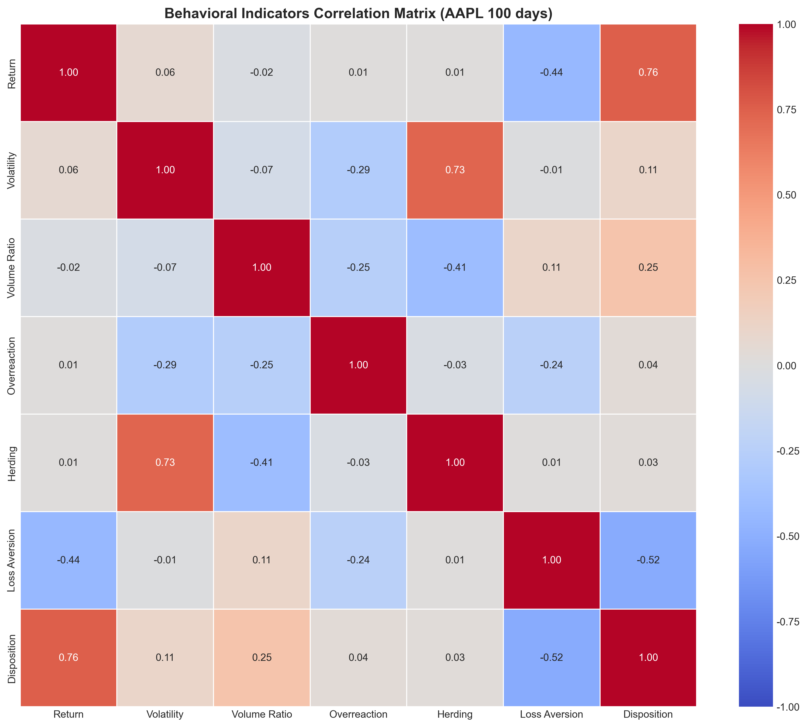
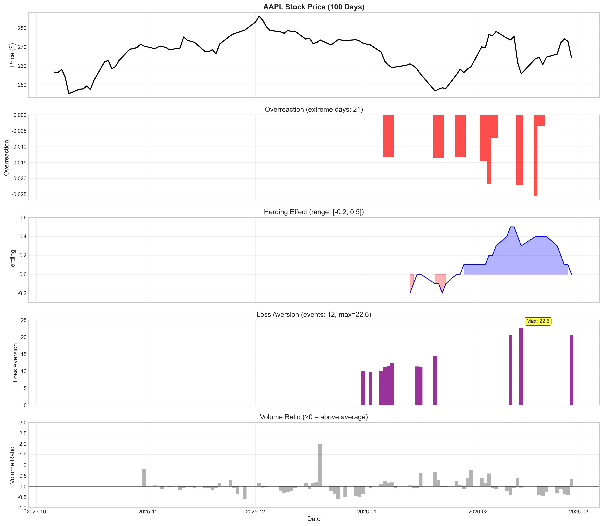
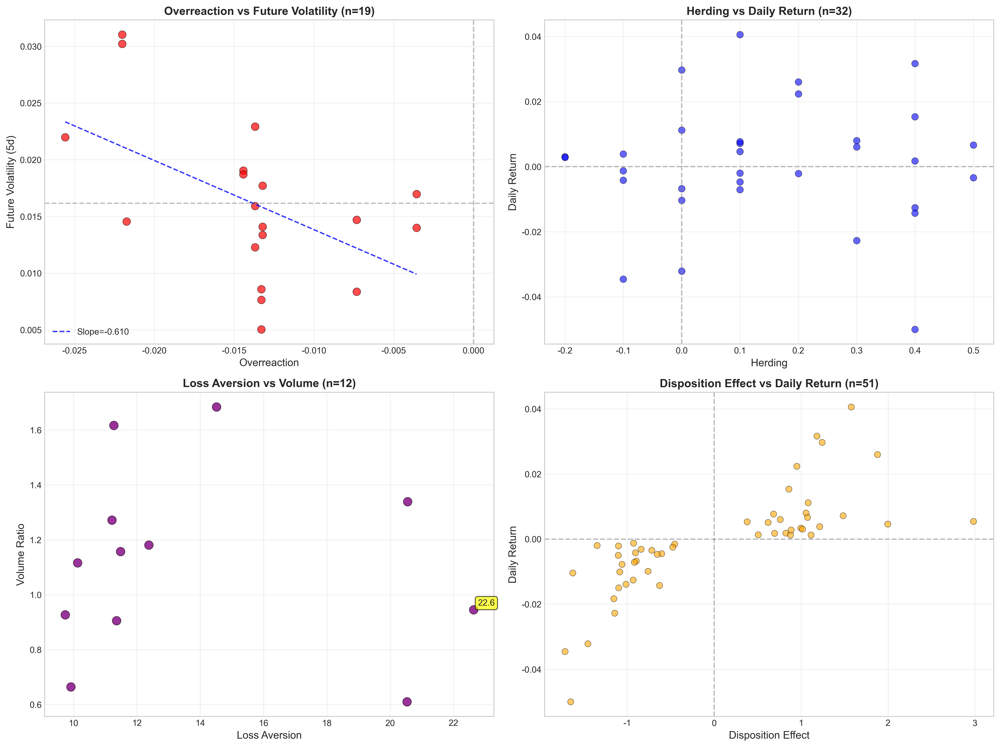

# Quantifying Investor Biases in Equity Markets: Evidence from AAPL
### A Behavioral Finance Empirical Analysis Using Python

[](https://www.python.org/downloads/)
[](https://jupyter.org/)
[](https://opensource.org/licenses/MIT)
[]()

---

## 📋 Executive Summary

This project constructs and quantifies key behavioral finance indicators — **Overreaction, Herding, Loss Aversion, and Disposition Effect** — using 100 trading days of AAPL stock data (Oct 2025 – Feb 2026) obtained from the Alpha Vantage API.

Through statistical analysis, correlation modeling, and OLS regression, the study investigates how investor psychological biases relate to return dynamics and volatility amplification.

The findings suggest strong statistical relationships between herding behavior and market volatility, and evidence supporting classical behavioral finance theories such as the disposition effect.

---

## 🎯 Research Motivation

Financial markets are not fully rational. Behavioral finance theory suggests that systematic cognitive biases affect pricing dynamics and volatility clustering.

This project translates theoretical behavioral constructs into measurable quantitative indicators and empirically tests their statistical relevance using real market data. The goal is to bridge psychological theory and financial econometrics.

---

## 📊 Data

| Attribute | Description |
|-----------|-------------|
| **Asset** | AAPL (Apple Inc.) |
| **Period** | October 6, 2025 – February 27, 2026 |
| **Trading Days** | 100 |
| **Price Range** | $245.27 – $286.19 |
| **Data Source** | Alpha Vantage API |

---

## 📈 Behavioral Indicators Constructed

| Indicator | Methodology | Interpretation |
|-----------|-------------|----------------|
| **Overreaction** | Z-score of abnormal returns; extreme threshold detection (\|z\| > 2) | Measures price overshooting behavior after news events |
| **Herding** | Price direction × Volume direction consistency with rolling smoothing | Captures crowd-following behavior in trading |
| **Loss Aversion** | Identifies consecutive loss sequences (≥3 days); measures volatility amplification after drawdowns | Quantifies fear-driven selling after losses |
| **Disposition Effect** | Trading intensity asymmetry between gain days and loss days | Captures tendency to sell winners too early and hold losers too long |

---

## 🔬 Statistical Analysis

- **Descriptive Statistics**: Summary metrics for all indicators
- **Correlation Matrix**: Relationships between behavioral indicators and market variables
- **OLS Regression**:
  ```
  Future Volatility ~ Overreaction + Herding + Loss Aversion + Disposition + Volume Ratio
  ```
- **Extreme Event Identification**: Top 10 days per indicator

---

## 💡 Key Findings

| Finding | Statistic | Implication |
|---------|-----------|-------------|
| **Herding-Volatility Link** | r = 0.728 | Strong positive correlation; crowd behavior amplifies market volatility |
| **Disposition Effect** | r = 0.756 | Strong association with return magnitude; confirms theory |
| **Loss Aversion Amplification** | Max = 22.63x | Extreme fear-driven volatility after drawdowns |
| **Overreaction Events** | 21 days | Regular price overshooting in the sample period |
| **Model Explanatory Power** | R² = 0.445 | Behavioral indicators significantly improve volatility prediction |

These findings are consistent with classical behavioral finance theory and demonstrate measurable bias patterns in equity markets.

---

## 🖼️ Sample Visualizations

### Correlation Heatmap


### Time Series Analysis


### Relationships Between Indicators


### Interactive Dashboard
An interactive Plotly dashboard is available for dynamic exploration:
- File: `output/aapl_dashboard_complete.html`
- Open in any browser to zoom, pan, and hover over data points

---

## 🚀 Quick Start

### Prerequisites
- Python 3.10+
- Git

### Installation

```bash
# Clone the repository
git clone https://github.com/yourusername/behavioral_finance_project.git
cd behavioral_finance_project

# Install required packages
pip install -r requirements.txt
```

### Running the Analysis

```bash
# Start Jupyter Notebook
jupyter notebook

# Open and run the main notebook
# File: behavioral_finance_analysis.ipynb
# Run all cells sequentially to reproduce the analysis
```

### Viewing Results

- **Interactive Dashboard**: Open `output/aapl_dashboard_complete.html` in your browser
- **Static Charts**: All PNG files in the `output/` folder
- **Statistical Tables**: CSV files in `output/tables/` (if generated)

---

## 📁 Project Structure

```
behavioral_finance_project/
│
├── behavioral_finance_analysis.ipynb   # Main analysis notebook
├── requirements.txt                     # Python dependencies
├── README.md                            # Project documentation
│
├── data/                                 # Raw and processed data
│   ├── AAPL_alphavantage.csv            # Raw price data from Alpha Vantage
│   └── AAPL_all_indicators.csv          # Complete dataset with all indicators
│
└── output/                               # Generated outputs
    ├── aapl_dashboard_complete.html     # Interactive Plotly dashboard
    ├── correlation_heatmap_final.png    # Correlation matrix visualization
    ├── relationships_final.png           # Scatter plots of relationships
    ├── timeseries_full.png               # Complete time series view
    ├── multi_stock_comparison.png        # AAPL vs MSFT vs TSLA comparison
    ├── monthly_analysis_real.png         # Monthly trend analysis
    └── tables/                           # Statistical tables (CSV)
        ├── descriptive_stats.csv
        ├── behavioral_stats.csv
        ├── correlation_matrix.csv
        ├── regression_results.txt
        ├── top_overreaction.csv
        ├── top_herding.csv
        └── top_loss.csv
```

---

## 🛠️ Technical Stack

- **Language**: Python 3.10+
- **Data Processing**: Pandas, NumPy
- **Statistical Analysis**: Statsmodels, SciPy
- **Visualization**: Matplotlib, Seaborn, Plotly
- **Data Acquisition**: Alpha Vantage API
- **Environment**: Jupyter Notebook

---

## 🔮 Future Extensions

- **Multi-asset Analysis**: Cross-sectional comparison across sectors and market caps
- **Longer Time Horizon**: Cover full bull/bear market cycles (1-5 years)
- **Machine Learning**: XGBoost/LSTM models for volatility forecasting
- **Alternative Data**: Integrate news sentiment and social media indicators
- **Strategy Backtesting**: Develop trading strategies based on behavioral signals
- **Parameter Sensitivity**: Test robustness across different window lengths and thresholds

---

## 👩‍💻 Author

**Elena Han**
- Economics & Finance
- Research interests: Behavioral finance, decision science, financial econometrics
- GitHub: [@Elena0794](https://github.com/Elena0794)

---

## 📚 Citation

If you use this code or methodology in your research, please cite:

```bibtex
@misc{han2026behavioral,
  author = {Elena Han},
  title = {Quantifying Investor Biases in Equity Markets: Evidence from AAPL},
  year = {2026},
  publisher = {GitHub},
  journal = {GitHub Repository},
  url = {https://github.com/yourusername/behavioral_finance_project}
}
```

---

## 📄 License

This project is licensed under the MIT License - see the [LICENSE](LICENSE) file for details.

---

**⭐ If you find this project useful, please consider giving it a star!**
